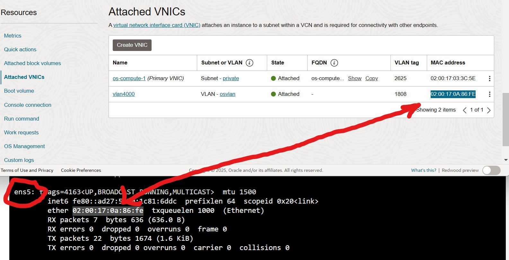

# OCI-OpenShift-Floating-EgressIP

If you want to use a fixed egress IP address in openshift for your pods, you need to make sure that the egress IP is "floatable" across your worker nodes. In case the host fails that was assigned to the 


### Create VLAN and assign addition vNIC(s) to worker nodes attached to the VLAN in OCI

1. Create a VLAN and assign it a CIDR range. The first available address in this CIDR range will be used by OCI for the gateway service.
All other addresses are free to be used. There is no DHCP service in the VLAN.

In this example, we have created a VLAN with the CIDR: 10.0.101.0/24. Hence the default gateway of this segment will be 10.0.101.1

2. On each worker node VM add a vNIC attached to the created VLAN
3. Login to one of the worker nodes and confirm a 2nd NIC is visible and note down the device name (In our example it is ens5)




### Setup IP configuration for worker nodes

1. Install openshift-nmstate operator via the operator hub, After installation, click on 'create instance' on the operator and create

Check if the NodeNetworkConfigurationPolicy CRD exists
linux: oc get crds | grep nodenetworkconfigurationpolicies
windows: oc get crds | findstr nodenetworkconfigurationpolicies


2. Create node_config.yaml:

```
apiVersion: nmstate.io/v1
kind: NodeNetworkConfigurationPolicy
metadata:
  name: node1-ens5-vlan-static-ip
spec:
  nodeSelector:
    kubernetes.io/hostname: os-compute-1.private.openshiftvcn.oraclevcn.com
  desiredState:
    interfaces:
      - name: ens5
        type: ethernet
        state: up
        ipv4:
          enabled: true
          address:
            - ip: 10.0.101.11
              prefix-length: 24
          dhcp: false
        mtu: 9000
    routes:
      config:
        - destination: 0.0.0.0/0
          next-hop-address: 10.0.101.1
          next-hop-interface: ens5
          metric: 500
---
apiVersion: nmstate.io/v1
kind: NodeNetworkConfigurationPolicy
metadata:
  name: node2-ens5-vlan-static-ip
spec:
  nodeSelector:
    kubernetes.io/hostname: os-compute-2.private.openshiftvcn.oraclevcn.com
  desiredState:
    interfaces:
      - name: ens5
        type: ethernet
        state: up
        ipv4:
          enabled: true
          address:
            - ip: 10.0.101.12
              prefix-length: 24
          dhcp: false
        mtu: 9000
    routes:
      config:
        - destination: 0.0.0.0/0
          next-hop-address: 10.0.101.1
          next-hop-interface: ens5
          metric: 500
---

```

3. Apply the configuration:
```
oc apply -f node_config.yaml
```

4. enable ipForwarding to the network.operator

```
oc edit network.operator

			  defaultNetwork:
			    ovnKubernetesConfig:
			      egressIPConfig: {}
			      gatewayConfig:
			        ipForwarding: Global
```